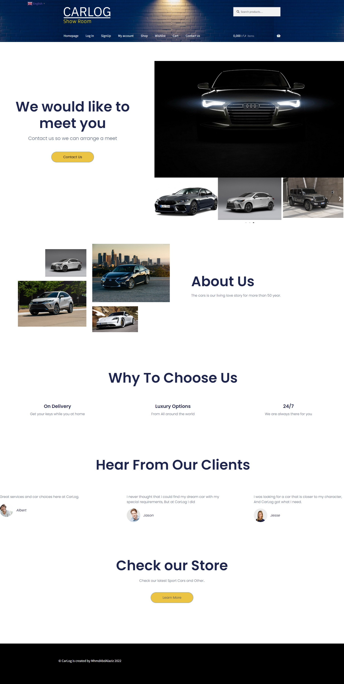

# WPCarLog

 _E-commerce website using WordPress The user can add product to carts and make payment,  and the user also can search for the products and add them into the cart._

# Content
- CarLog WireFrame
- CarLog Mockup

# Screen Shots

1. WireFrame
- Home Page

- SignIn

- SignUp

- Account

- Shop

- WishList

- ContactUS

----------

2. MockUp
- Home Page

- LogIn

- SignUP

- My Account

- Shop

- WishList

- Cart

- Contact

----------

**Hope You like it ,Thank you for your time.**

